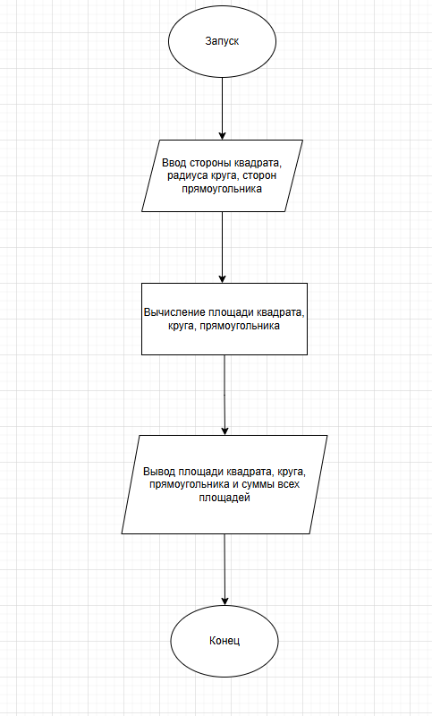

# Отчёт по лабораторной работе №1  
**Тема:** Императивное (процедурное) программирование  

---

## Сведения о студенте  
**Дата:** [YYYY-MM-DD]  
**Семестр:** [2 курс, 1 семестр]  
**Группа:** [Пин-б-о-24-1]  
**Дисциплина:** [Технологие програмирования]  
**Студент:** [Лебский Арётм Александрович]  

---

## Цель работы  
Познакомиться с особенностями процедурного программирования. Решить задания в процедурном стиле. Составить отчёт.

---

## Ход работы  

### 1. Теоретическая часть  
Процедурное программирование — это стиль программирования, при котором программа представляет собой последовательность команд, выполняемых одна за другой. Основные элементы:  
- Переменные  
- Функции  
- Процедуры  
- Безусловные переходы (в историческом контексте)  

Программа выполняется шаг за шагом, преобразуя исходные данные в результат.  

---

### 2. Практическая часть  

#### Задание 1: Программа для вычисления площади трёх фигур  

**Вариант 1:**  
Написать программу, рассчитывающую площадь квадрата, круга и прямоугольника. На выходе — площади фигур и их сумма.  

**Псевдокод:**  
```
алг Вычисление площади трёх фигур(арг вещ a, Рез S_a, арг вещ r, Рез S_r, арг вещ b, арг вещ c, Рез S_bc)
дано | r > 0, pi = 3.14, b > 0, c > 0
надо | S_a, S_r, S_bc
нач
ввод a, r, b, c
S_a = a^2
S_r = r^2 * pi
S_bc = b * c
вывод S_a, S_r, S_bc, S_a + S_r + S_bc
кон
```


**Блок-схема:**  


**Реализация на R:**  
```r
a <- 5
r <- 5
b <- 4
c <- 5
pi <- 3.14

S_kvadrat <- function(a) {
    return(a^2)
}
S_Kryg <- function(r, pi) {
    return(r^2 * pi)
}
S_Pramo <- function(b, c) {
    return(b * c)
}

S_a <- S_kvadrat(a)
S_r <- S_Kryg(r, pi)
S_bc <- S_Pramo(b, c)
symm <- S_a + S_r + S_bc

print(S_a)
print(S_r)
print(S_bc)
print(symm)
```
**Вывод:**
```
25
78.5
20
123.5
```

#### Задание 2: Анализ и реализация ассемблерного кода
**Исходный код на ассемблере (AT&T синтаксис):**
```asm
foo:
    cmp $0, %edi      ; Сравнение n с 0
    jg calc           ; Если n > 0, переход к calc
    mov $1, %eax      ; Базовый случай: возвращаем 1
    jmp exit          ; Переход к завершению
calc:
    push %edi         ; Сохраняем n в стеке
    sub $1, %edi      ; n = n - 1
    call foo          ; Рекурсивный вызов foo(n-1)
    pop %edi          ; Восстанавливаем n из стека
    imul %edi, %eax   ; Умножаем результат на n
exit:
    ret               ; Возврат из функции
```
**Псевдокод:**
```
алг Факториал(арг цел n)  
нач  
    если n <= 0  
        вернуть 1  
    иначе  
        вернуть n * Факториал(n - 1)  
кон
```
**Реализация на R:**
```r
foo <- function(n) {
    if (n <= 0) {
        return(1)
    } else {
        return(n * foo(n - 1))
    }
}
```

**Результат для n = 7:**
```
5040
```

---

## **Результаты**


### **Структура репозитория:**
```
labs/lab1/
├── # Отчёт по лабораторной работе №1.md
├── README.md
├── main.R # Задание 1: Вычисление площадей фигур
├── assembly_to_R.R # Задание 2: Реализация ассемблерного кода на R
├── Псевдокод.txt # Псевдокод для обоих заданий
└── diagram.png # Блок-схема алгоритма
```


### **Ссылка на репозиторий:**  
[GitHub Repository Link](https://github.com/Vasapypkin646/labs)  

---

## *Вывод*
На основе выполненной лабораторной работы и изученных материалов можно сделать следующие выводы:
В ходе работы были успешно освоены ключевые принципы императивного (процедурного) программирования. Этот стиль программирования основан на последовательном выполнении команд, которые преобразуют исходные данные в результат путем изменения состояния памяти. Основными элементами процедурного подхода являются переменные, функции и процедуры, которые позволяют структурировать код и делать его более читаемым и повторно используемым.
На практическом уровне была реализована программа на языке R, которая вычисляет площади трёх геометрических фигур: квадрата, круга и прямоугольника. Программа демонстрирует использование функций для инкапсуляции логики вычислений, что соответствует принципам процедурного программирования. Также был проведён анализ ассемблерного кода, реализующего рекурсивный алгоритм вычисления факториала, и выполнена его адаптация на R. Это позволило лучше понять, как работают рекурсивные вызовы и управление памятью на низком уровне.
Кроме того, были изучены исторические аспекты развития процедурного программирования, включая использование безусловных переходов (таких как goto), которые в современных языках применяются редко из-за сложности сопровождения такого кода (так называемый "спагетти-код"). Современные процедурные языки предлагают более структурированные подходы, такие как циклы и условные операторы, что делает код более предсказуемым и удобным для анализа.
Процедурный стиль тесно связан с архитектурой фон Неймана, где программа и данные хранятся в одной памяти, а выполнение происходит последовательно, команда за командой. Это подчёркивает фундаментальную связь между аппаратной частью компьютера и программной реализацией алгоритмов.
Таким образом, лабораторная работа позволила не только приобрести практические навыки написания процедурных программ на R, но и глубже понять исторические и архитектурные основы императивного программирования. Это важный этап в подготовке к изучению более сложных парадигм, таких как объектно-ориентированное и функциональное программирование.

