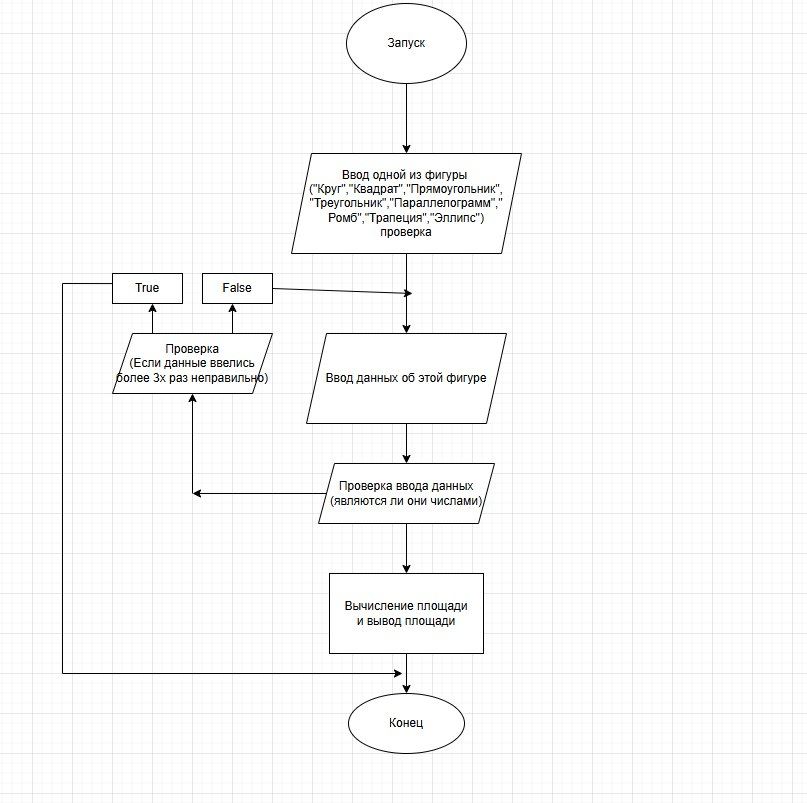
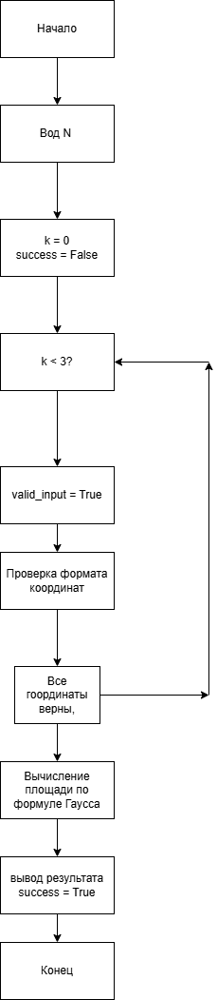

# Отчёт по лабораторной работе №2  
**Тема:** Структурное программирование  

---

## Сведения о студенте  
**Дата:** [YYYY-MM-DD]  
**Семестр:** [2 курс, 1 семестр]  
**Группа:** [Пин-б-о-24-1]  
**Дисциплина:** [Технологии программирования]  
**Студент:** [Лебский Артём Александрович]  

---

## Цель работы  
Познакомиться с особенностями структурного программирования. Решить задания в структурном стиле. Составить отчёт.  

---

## Ход работы  

### 1. Теоретическая часть  
Структурное программирование – методология разработки программного обеспечения, в основе которой лежит представление программы в виде иерархической структуры блоков.  

**Основные принципы структурного программирования:**  
- Использование трёх базовых управляющих структур: последовательность, ветвление, цикл  
- Разработка программы методом «сверху вниз»  
- Исключение оператора `goto`  

**Теорема Бёма – Якопини:**  
Любой исполняемый алгоритм может быть преобразован к структурированному виду с использованием трёх структур управления: последовательной, ветвлений и циклов.  

**Основные конструкции циклов в R:**  
- Бесконечный цикл:  
  ```r
  repeat { ... }
  while(TRUE) { ... }
  ```
- Цикл с предусловием:
  ```r
  while(условие) { ... }
  ```
- Цикл со счётчиком:
  ```r
  for (i in 1:n) { ... }
  ```

---

### 2. Практическая часть

#### Задание 1: Программа для вычисления площади фигур

Программа запрашивает у пользователя название фигуры, затем параметры для вычисления площади. Если ввод некорректен более 3 раз, программа завершается с сообщением об ошибке.

**Пример кода:**  

```r
user_input <- readline()
user_input <- "Эллипс"
spis <- c("Круг","Квадрат","Прямоугольник","Треугольник","Параллелограмм","Ромб","Трапеция","Эллипс")


Kryg <- function(r){
    number <- as.integer(a)
    pi <- 3.14
    return(number * r^2)
}


for (i in spis){
    if (user_input == i){
        if (i == "Квадрат"){
            k <- 0
            while(TRUE){
                if (k == 3){
                    print("1234")
                    break
                }
                a <- readline()
                a <- "5"
                if (grepl("^\\d+$", a)){
                    number <- as.integer(a)
                    print("S Квадрат")
                    print(number^2)
                    break
                }
                else{
                    k <- k + 1
                }
            }
            
        }
        if (i == "Круг"){
            k <- 0
            while(TRUE){
                if (k == 3){
                    print("1234")
                    break
                }
                r <- readline()
                r <- "5"
                if (grepl("^\\d+$", r)){
                    pi <- 3.14
                    number <- as.integer(r)
                    print("S Круг")
                    print(pi * number^2)
                    break
                }
                else{
                    k <- k + 1
                }
            }
            
        }
        if (i == "Прямоугольник"){
            k <- 0
            while(TRUE){
                if (k == 3){
                    print("1234")
                    break
                }
                a <- readline()
                a <- "5"
                b <- readline()
                b <- "10"
                if (grepl("^\\d+$", a) & grepl("^\\d+$", b)){
                    
                    a_int <- as.integer(a)
                    b_int <- as.integer(b)
                    print("S Прямоугольник")
                    print(a_int * b_int)
                    break
                }
                else{
                    k <- k + 1
                }
            }
            
        }
        if (i == "Треугольник"){
            k <- 0
            while(TRUE){
                if (k == 3){
                    print("1234")
                    break
                }
                a <- readline()
                a <- "5"
                h <- readline()
                h <- "10"
                if (grepl("^\\d+$", a) & grepl("^\\d+$", h)){
                    
                    a_int <- as.integer(a)
                    h_int <- as.integer(h)
                    print("S Треугольник")
                    print(0.5 * a_int * h_int)
                    break
                }
                else{
                    k <- k + 1
                }
            }
            
        }
        if (i == "Параллелограмм"){
            k <- 0
            while(TRUE){
                if (k == 3){
                    print("1234")
                    break
                }
                a <- readline()
                a <- "5"
                h <- readline()
                h <- "10"
                if (grepl("^\\d+$", a) & grepl("^\\d+$", h)){
                    
                    a_int <- as.integer(a)
                    h_int <- as.integer(h)
                    print("S Параллелограмм")
                    print(a_int * h_int)
                    break
                }
                else{
                    k <- k + 1
                }
            }
            
        }
        if (i == "Ромб"){
            k <- 0
            while(TRUE){
                if (k == 3){
                    print("1234")
                    break
                }
                a <- readline()
                a <- "5"
                h <- readline()
                h <- "10"
                if (grepl("^\\d+$", a) & grepl("^\\d+$", h)){
                    
                    a_int <- as.integer(a)
                    h_int <- as.integer(h)
                    print("S Ромб")
                    print(a_int * h_int)
                    break
                }
                else{
                    k <- k + 1
                }
            }
            
        }
        if (i == "Трапеция"){
            k <- 0
            while(TRUE){
                if (k == 3){
                    print("1234")
                    break
                }
                a <- readline()
                a <- "5"
                b <- readline()
                b <- "10"
                h <- readline()
                h <- "10"
                if (grepl("^\\d+$", a) & grepl("^\\d+$", h) & grepl("^\\d+$", b)){
                    
                    a_int <- as.integer(a)
                    b_int <- as.integer(b)
                    h_int <- as.integer(h)
                    print("S Трапеция")
                    print((a_int + b_int) * h_int * 0.5)
                    break
                }
                else{
                    k <- k + 1
                }
            }
            
        }
        if (i == "Эллипс"){
            k <- 0
            while(TRUE){
                if (k == 3){
                    print("1234")
                    break
                }
                a <- readline()
                a <- "5"
                b <- readline()
                b <- "10"
                
                if (grepl("^\\d+$", a) & grepl("^\\d+$", b)){
                    pi = 3.14
                    a_int <- as.integer(a)
                    b_int <- as.integer(b)
                    
                    print("S Эллипс")
                    print(a_int * b_int * pi)
                    break
                }
                else{
                    k <- k + 1
                }
            }
            
        }
    }
}
```

**Пример ввода:**
```
Эллипс
5
10
```
**Вывод:**
```
Вывод: S Эллипс = 157
```

**Блок-схема:**  


#### Задание 2: Программа для вычисления площади неправильного многоугольника

Программа принимает количество вершин многоугольника и их координаты, затем вычисляет площадь по формуле Гаусса.

**Пример кода:**
```r
user_input_N <- "4"

N <- as.integer(user_input_N)

calculate_polygon_area <- function(coords) {
    n <- nrow(coords)
    area <- 0
    
    for (i in 1:n) {
        j <- ifelse(i == n, 1, i + 1)
        area <- area + (coords[i, 1] * coords[j, 2] - coords[j, 1] * coords[i, 2])
    }
    
    return(abs(area) / 2)
}

vertices <- matrix(0, nrow = N, ncol = 2)
colnames(vertices) <- c("x", "y")

k <- 0
success <- FALSE

while (TRUE) {
    if (k == 3) {
        print("Ошибка: превышено количество попыток ввода")
        break
    }
    
    valid_input <- TRUE
    coords_list <- list()
    
    for (i in 1:N) {
        coord_input <- readline()
        if (i == 1) coord_input <- "0 0"
        if (i == 2) coord_input <- "4 0" 
        if (i == 3) coord_input <- "4 3"
        if (i == 4) coord_input <- "0 3"
        
        if (grepl("^-?\\d+\\s+-?\\d+$", coord_input)) {
            coords <- as.integer(strsplit(coord_input, "\\s+")[[1]])
            if (length(coords) == 2) {
                coords_list[[i]] <- coords
            } else {
                valid_input <- FALSE
                break
            }
        } else {
            valid_input <- FALSE
            break
        }
    }
    
    if (valid_input && length(coords_list) == N) {
        for (i in 1:N) {
            vertices[i, 1] <- coords_list[[i]][1]
            vertices[i, 2] <- coords_list[[i]][2]
        }
        
        area <- calculate_polygon_area(vertices)
        print("Площадь многоугольника:")
        print(area)
        success <- TRUE
        break
    } else {
        k <- k + 1
        if (k < 3) {
            print("Ошибка ввода. Попробуйте снова.")
        }
    }
}

if (!success) {
    print("Используем альтернативный метод расчета...")
    
    polygon_area_alternative <- function(x_coords, y_coords) {
        n <- length(x_coords)
        area <- 0
        
        for (i in 1:n) {
            j <- ifelse(i == n, 1, i + 1)
            area <- area + (x_coords[i] * y_coords[j] - x_coords[j] * y_coords[i])
        }
        
        return(abs(area) / 2)
    }
    
    x_coords <- c(0, 4, 4, 0)
    y_coords <- c(0, 0, 3, 3)
    
    area_alt <- polygon_area_alternative(x_coords, y_coords)
    print("Площадь многоугольника (альтернативный расчет):")
    print(area_alt)
}
```


**Пример ввода:**
```
4
0 0
4 0
4 3
0 3
```
**Вывод:**
```
Площадь многоугольника: 12
```

**Блок-схема:**  


---

## **Результаты**  

### **Структура репозитория:**  
```
labs/lab2/
├── # Отчёт по лабораторной работе №2.md
├── zadanie_1.R
├── zadanie_2.R
├── diagram1.jpg
├── diagram2.png
└── README.md
```

### **Ссылка на репозиторий:**  
[GitHub Repository Link](https://github.com/Vasapypkin646/lab2)  

---

## *Выводы*
На основе выполненной лабораторной работы по структурному программированию можно сделать следующие выводы:
Структурное программирование представляет собой важный этап в эволюции методологий разработки программного обеспечения. Его основная ценность заключается в организации кода через использование трёх базовых управляющих структур — последовательности, ветвления и циклов — при полном отказе от оператора goto. Это позволяет создавать более понятные, предсказуемые и сопровождаемые программы.
Практическая реализация задания по вычислению площадей различных геометрических фигур на языке R наглядно продемонстрировала преимущества структурного подхода. Программа была построена с использованием иерархической структуры: после ввода пользователем названия фигуры осуществляется проверка корректности данных через циклы while с предусловием, а для каждой фигуры реализована отдельная логика вычислений. Особое внимание было уделено обработке ошибок — при трёхкратном некорректном вводе программа завершается с соответствующим сообщением, что соответствует принципам надёжности.
Второе задание, связанное с вычислением площади неправильного многоугольника по координатам вершин, позволило применить более сложные алгоритмические конструкции. Использование формулы Гаусса и работа с массивами координат потребовали создания циклов for для обработки вершин многоугольника и организации проверки корректности вводимых данных. Это задание особенно ярко показало, как структурное программирование способствует решению сложных математических задач через декомпозицию на последовательные шаги.
Теоретическая основа работы, включая теорему Бёма-Якопини, подтвердила, что любой алгоритм может быть выражен через базовые управляющие структуры. На практике это выразилось в использовании циклов разных типов (while, for), условных операторов if-else и функций для организации кода.
Таким образом, лабораторная работа позволила не только освоить синтаксические конструкции языка R, но и глубоко понять философию структурного программирования. Приобретённые навыки организации кода, обработки ошибок и построения алгоритмов являются фундаментальными для дальнейшего изучения более сложных парадигм программирования. Структурный подход доказал свою эффективность для создания читаемого, модульного и сопровождаемого кода, что особенно важно при разработке средних и крупных программных проектов.
